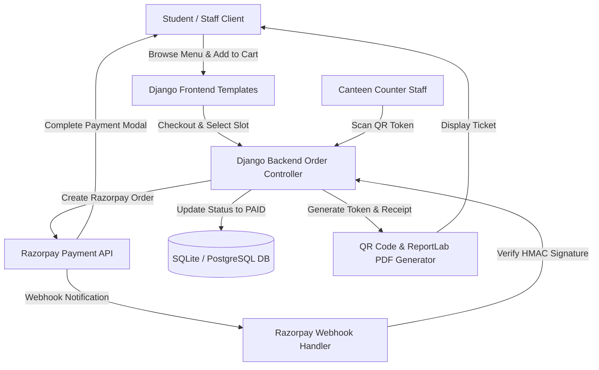

# 🍽️ LICET Cafeteria — Smart Campus Canteen & Food Ordering System

[](https://www.python.org/)
[](https://www.djangoproject.com/)
[](https://razorpay.com/)
[]()

> A full-stack, web-based canteen management and pre-ordering web application designed for **Loyola-ICAM College of Engineering and Technology (LICET)**. It streamlines campus food ordering, minimizes peak-hour queue bottlenecks, enables scheduled pickup slots, processes seamless digital payments via **Razorpay**, and provides QR-code based order validation.

---

## 📋 Table of Contents
- [Overview](#-overview)
- [Key Features](#-key-features)
- [Tech Stack](#-tech-stack)
- [System Architecture](#-system-architecture)
- [Project Structure](#-project-structure)
- [Getting Started](#-getting-started)
  - [Prerequisites](#prerequisites)
  - [Installation](#installation)
  - [Environment Variables Setup](#environment-variables-setup)
  - [Database Migrations & Superuser](#database-migrations--superuser)
  - [Running the Application](#running-the-application)
- [Payment & Webhook Configuration](#-payment--webhook-configuration)
- [Key Data Models](#-key-data-models)
- [Roadmap & Future Enhancements](#-roadmap--future-enhancements)
- [License & Credits](#-license--credits)

---

## 🌟 Overview

The **LICET Cafeteria System** solves peak-hour overcrowding in college canteens by empowering students and faculty to browse real-time food availability, customize orders, pick preferred pickup time slots (dine-in or takeaway), and pay securely online using UPI, credit/debit cards, or net banking via Razorpay.

Upon payment completion, users receive a unique **QR Pickup Token** and a downloadable **PDF Invoice**, which canteen staff scan for lightning-fast order fulfillment.

---

## ⚡ Key Features

### 👤 User Management & Profiles
- **Authentication**: Secure registration, login, and session management using Django's authentication system.
- **Student Profile**: Academic metadata tracking (Department, Year of Study, Batch, Phone Number, DOB).
- **Custom Avatars**: User profile picture upload with automatic thumbnail cropping and image optimization.

### 🍔 Menu & Catalog Browsing
- **Category Filtering**: Seamless navigation across categories (Breakfast, Lunch, Snacks, Beverages, Specials).
- **Live Availability Toggle**: Real-time item availability status (`is_sale`) managed by kitchen staff.

### 🛒 Smart Cart & Scheduled Pickup
- **Session-Based Cart**: Persistent shopping cart across user sessions.
- **Pickup Time Slots**: Custom time slot allocation (e.g. `12:45 PM - 1:00 PM`) to regulate rush-hour crowds.
- **Order Type Options**: Choose between **Dine-In** and **Takeaway**.

### 💳 Razorpay Payment Gateway Integration
- **Direct Checkout**: Smooth payment modal integration supporting UPI, Google Pay, PhonePe, Cards, & Netbanking.
- **Security**: Server-side HMAC-SHA256 signature verification preventing payment forgery.
- **Webhook Handling**: Automated payment status updates (`pending` → `paid` / `failed` / `refunded`).

### 🎟️ Digital QR Tokens & PDF Invoices
- **QR Pickup Tokens**: Unique UUID-backed QR codes generated for each verified transaction (`qrcode[pil]`).
- **Downloadable PDF Receipts**: Instant invoice generation using **ReportLab** containing order details, payment ID, and pickup window.

---

## 🛠️ Tech Stack

| Domain | Technology / Library | Description |
| :--- | :--- | :--- |
| **Backend Framework** | Django 5.0+, Python 3.10+ | Robust web backend, ORM, & administrative control |
| **Database** | SQLite / PostgreSQL | Relational storage for products, orders, users, and transactions |
| **Payment Gateway** | Razorpay SDK (`razorpay`) | Secure checkout & webhook status synchronization |
| **Frontend** | HTML5, Vanilla CSS3, JavaScript | Responsive user interface and dynamic shopping cart |
| **Image Processing** | Pillow (`PIL`) | Automatic thumbnail generation and banner scaling |
| **PDF Generation** | ReportLab | Automated generation of downloadable customer invoices |
| **QR Generation** | `qrcode[pil]` | Automated creation of unique order validation tokens |
| **Config & Environment** | `python-decouple`, `python-dotenv` | Secure handling of API credentials and keys |
| **Production Server** | Gunicorn, WhiteNoise | WSGI server & static assets management |

---

## 🏗️ System Architecture



---

## 📁 Project Structure

```
LICET-Cafeteria/
├── backend/
│   ├── base/                  # Core app (Users, Products, Categories, Profiles)
│   ├── canteen_web/           # Project configuration & settings module
│   ├── cart/                  # Session cart context processors & logic
│   ├── payments/              # Razorpay payment views, webhooks, & invoicing
│   ├── media/                 # Uploaded product images & profile avatars
│   ├── requirements.txt       # Python dependency requirements
│   ├── .env.example           # Template for environment variables
│   └── manage.py              # Django management utility
├── frontend/
│   ├── static/                # Custom CSS styles, JavaScript, & static assets
│   └── templates/             # HTML5 templates (Base, Home, Cart, Checkout, Profile)
├── docs/                      # Documentation assets
└── manage.py                  # Root entry script
```

---

## 🚀 Getting Started

### Prerequisites
- **Python 3.10+** installed
- **Git** installed
- **Razorpay Developer Account** (Key ID & Key Secret)

---

### Installation

1. **Clone the repository:**
   ```powershell
   git clone https://github.com/R-MANI-KANDAN/canteen-project-repo.git
   cd canteen-project-repo
   ```

2. **Create and activate a virtual environment:**
   ```powershell
   # Windows (PowerShell)
   python -m venv venv
   .\venv\Scripts\Activate
   ```

3. **Install dependencies:**
   ```powershell
   pip install -r backend/requirements.txt
   ```

---

### Environment Variables Setup

Create a `.env` file inside the `backend/` directory based on `.env.example`:

```ini
SECRET_KEY=your_django_secret_key_here
DEBUG=True
ALLOWED_HOSTS=localhost,127.0.0.1,.ngrok-free.app

# Razorpay API Credentials
RAZORPAY_KEY_ID=your_razorpay_key_id
RAZORPAY_KEY_SECRET=your_razorpay_key_secret
RAZORPAY_WEBHOOK_SECRET=your_webhook_secret
```

---

### Database Migrations & Superuser

Run migrations to set up the database schema and create an administrative user:

```powershell
# Navigate to project root
python manage.py makemigrations
python manage.py migrate

# Create admin superuser
python manage.py createsuperuser
```

---

### Running the Application

Start the local Django development server:

```powershell
python manage.py runserver
```

Open your browser and navigate to `http://127.0.0.1:8000/`.

Access Django Admin Panel at `http://127.0.0.1:8000/admin/`.

---

## 💳 Payment & Webhook Configuration

1. Log into your [Razorpay Dashboard](https://dashboard.razorpay.com/) in **Test Mode**.
2. Generate **Key ID** and **Key Secret** under *Settings → API Keys*.
3. Add a **Webhook URL** under *Settings → Webhooks*:
   - Webhook URL: `https://<your-ngrok-domain>/payments/webhook/`
   - Active Events: `payment.captured`, `payment.failed`, `order.paid`
4. Copy the Webhook Secret into your `.env` file as `RAZORPAY_WEBHOOK_SECRET`.

---

## 🗄️ Key Data Models

- **`Product`**: Contains title, category, subcategory, price, image, item code, and sale availability (`is_sale`).
- **`Order`**: Tracks customer, ordered items, quantity, pickup slot, dine-in/takeaway selection, payment status (`pending`, `paid`, `failed`), invoice number, and unique QR token UUID.
- **`Profile`**: Extends Django's `User` model with academic information (department, batch, year of study) and custom profile avatars.
- **`Category`**: Hierarchical category structure for food items.

---

## 🔮 Roadmap & Future Enhancements

- [ ] **Counter Staff Scanning Web App**: Dedicated mobile interface for kitchen staff to scan QR tokens.
- [ ] **Live Inventory Counter**: Automatic stock deduction when items are purchased.
- [ ] **SMS / WhatsApp Order Notifications**: Instant updates when an order is ready for pickup.
- [ ] **Analytics Dashboard**: Daily revenue reports, peak ordering hours analysis, and popular menu analytics.

---

## 📜 License & Credits

Developed with ❤️ for **LICET Canteen**.

Designed and Developed by **[R. Mani Kandan](https://github.com/R-MANI-KANDAN)**.

*For queries or contributions, feel free to submit an issue or open a pull request.*
